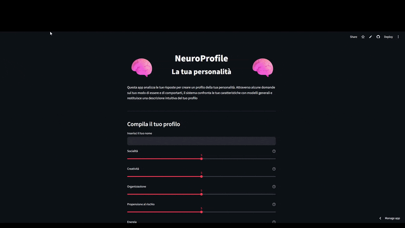

## 🎮 Demo dell’app

---

# 🧠 NeuroProfile 🧠 – Scopri la tua personalità con l’AI

**NeuroProfile** è una web-app interattiva che analizza i tuoi tratti comportamentali e genera un profilo di personalità tramite machine learning.

Attraverso alcuni semplici slider, il sistema costruisce una descrizione psicologica e un’analisi visiva del tuo profilo.

---

## 🚀 Cosa rende NeuroProfile diverso?

* 🧠 Analisi della personalità con algoritmo **KMeans**
* 🎯 Profilazione automatica basata sui tuoi input
* 📊 Grafico radar comparativo tra te e il tuo cluster
* ✍️ Descrizione personalizzata dinamica
* 🎨 Interfaccia moderna e intuitiva
* ⚡ Nessuna registrazione richiesta

---

## 🧬 Come funziona

Per ogni utente:

* 🎚️ Inserisce i propri valori (0–10)
* 🤖 Il modello assegna un cluster
* 🎭 Viene determinato il tipo di personalità
* 🧾 Viene generata una descrizione personalizzata
* 📈 Viene mostrato un grafico radar finale

---

## 🧠 Tipi di personalità

| Tipo | Descrizione |
|------|-------------|
| 👑 Leader | Dominante, energico e organizzato |
| 🎨 Creativo | Immaginativo e fuori dagli schemi |
| ⚖️ Equilibrato | Bilanciato e stabile |
| 🧭 Avventuroso | Ama rischio e novità |
| 🧠 Analitico | Razionale, preciso e logico |

---

## 📊 Tratti analizzati

* Socialità  
* Creatività  
* Organizzazione  
* Propensione al rischio  
* Energia

Ogni tratto viene valutato da **0 a 10**.

---

## ⚙️ Tecnologie utilizzate

* 🐍 Python
* 🎈 Streamlit
* 📊 Pandas
* 🔢 NumPy
* 🤖 Scikit-learn
* 📈 Matplotlib

---

## 🌐 Provalo subito

👉 **https://neuroprofile.streamlit.app/**

> 💡 Suggerimento: usa **Ctrl+Click** (o **Cmd+Click** su Mac) per aprire in una nuova scheda.

---

## 📄 Licenza

Distribuito sotto licenza **MIT** — vedi il file [LICENSE](LICENSE).